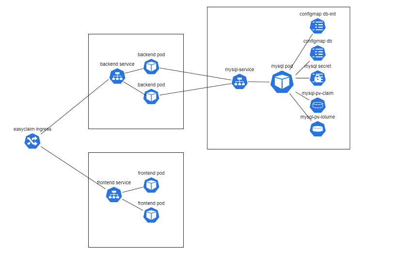

# Build a Kubernetes cluster using k3s on Proxmox via Terraform and deploy application with ArgoCD

This project demonstrates how to build virtual machines, Kubernetes cluster (container orchestration) and ArgoCD (Continuous delivery) for deploy our application, with Infrastructure as Code approach.


Our application is 3-tier and have separated repositories for frontend and backend

* [Frontend](https://github.com/ivan-krushkov/my-project-frontend)
* [Backend](https://github.com/ivan-krushkov/my-project-backend)
<br />
<br />




## System requirements

* Proxmox server
* [Terraform installed](https://learn.hashicorp.com/tutorials/terraform/install-cli)
* Helm 3


<br />
<br />

## **Proxmox setup**

This setup is relaying on cloud-init images.

To configure the cloud-init image we need to connect to a Linux server and run the following:

install image tools on the server (we need another server or linux machine, these tools cannot be installed on Proxmox)

```bash
apt-get install libguestfs-tools
```

Get the image

```bash
wget https://cloud-images.ubuntu.com/focal/current/focal-server-cloudimg-amd64.img
```

update the image and install Proxmox agent - this is a must if we want terraform to work properly.

```bash
virt-customize focal-server-cloudimg-amd64.img --install qemu-guest-agent
```

now that we have the image, we need to move it to the Proxmox server.
we can do that by using `scp`

```bash
scp focal-server-cloudimg-amd64.img Proxmox_username@Proxmox_host:/path_on_Proxmox/focal-server-cloudimg-amd64.img
```

so now we should have the image configured and on our Proxmox server. let's start creating the VM

```bash
qm create 9000 --name "ubuntu-focal-cloudinit-template" --memory 2048 --net0 virtio,bridge=vmbr0
```

rename the image suffix

```bash
mv focal-server-cloudimg-amd64.img focal-server-cloudimg-amd64.qcow2
```

import the disk to the VM

```bash
qm importdisk 9000 focal-server-cloudimg-amd64.qcow2 local-lvm
```

configure the VM to use the new image

```bash
qm set 9000 --scsihw virtio-scsi-pci --scsi0 local-lvm:vm-9000-disk-0
```

add cloud-init image to the VM

```bash
qm set 9000 --ide2 local-lvm:cloudinit
```

set the VM to boot from the cloud-init disk:

```bash
qm set 9000 --boot c --bootdisk scsi0
```

update the serial on the VM

```bash
qm set 9000 --serial0 socket --vga serial0
```

Good! So we are almost done with the image. Now we can configure our base configuration for the image.
We can connect to the Proxmox server and go to VM and look on the cloud-init tab, here you will find some more parameters that we will need to change.


We will need to add the ssh public key so we can connect to the VM later using terraform.
Update the variables and click on `Regenerate Image`

Great! So now we can convert the VM to a template and start working with terraform.

```bash
qm template 9000
```
<br />
<br />

## **Terraform setup**

Clone the repo to get all the files and cd into the folder.

```bash
git clone https://github.com/ivan-krushkov/telerik-final-project.git
```


Update `terraform/infrastructure/terraform.tfvars` and update all the vars.
There you can set proxmox hostname/IP, user and password for it, configure the name of the base image, authorization key, MetalLB configuration and password for ArgoCD admin user.

To run the Terraform, we will need to cd into `terraform/infrastructure` and run:

```bash
terraform init
terraform plan
terraform apply
```

For demonstration purposes the last two steps are sepparated into another terraform folder. We will need to cd into `terraform/applications` and run: 

```bash
terraform init
terraform plan
terraform apply
```

Now we can get an IP for nginx LoadBalancer to config DNS records for easyclaim.local and test:

```bash
echo `kubectl -n ingress-nginx get svc ingress-nginx-controller -o jsonpath="{.status.loadBalancer.ingress[*].ip}"`
```

Our application is deployed via `kustomize`. On every deploy step in frontend or backend repositories, tag version of corresponding image will be updated. ArgoCD will detect these changes and deploy new version.

<br />
<br />

## **Feature improvements**
In our project we are missing observability, continuous security scans, backup solution and coverage is not so good.

For observability we can use:
* Prometheus for monitoring
* Grafana for visualization
